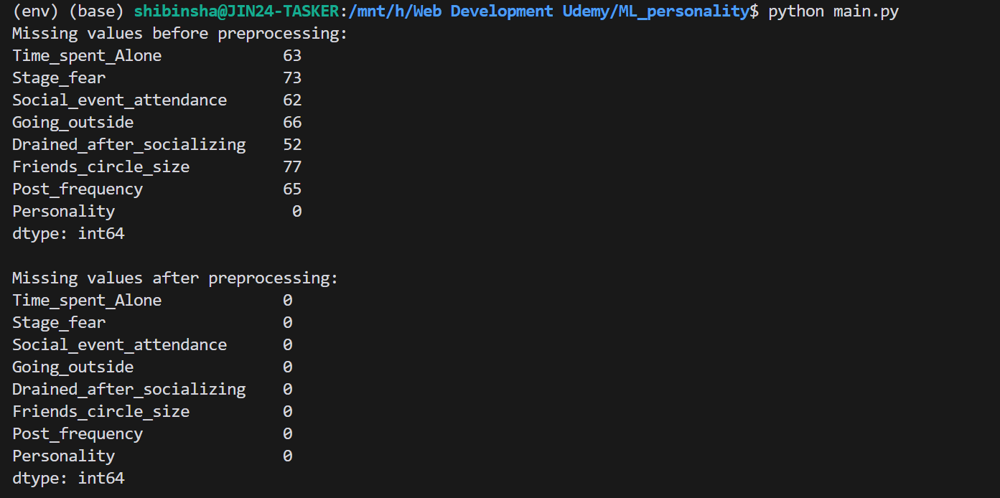
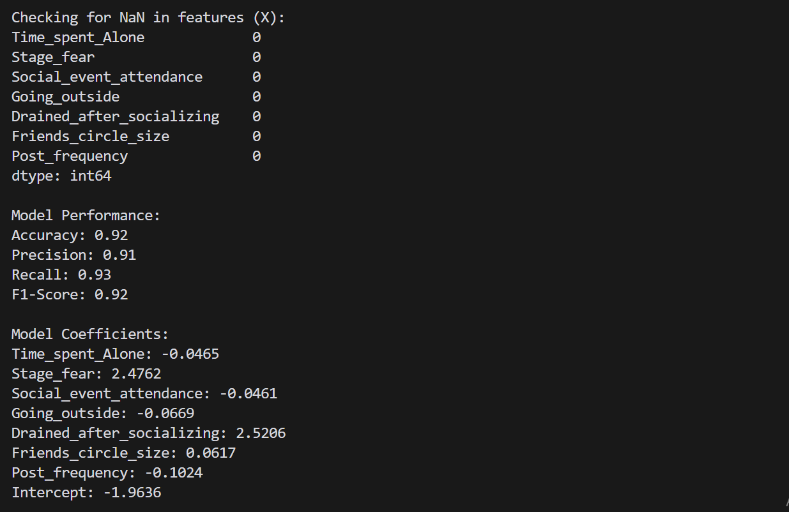

# Personality Prediction with Logistic Regression

This project implements a logistic regression model to predict personality types (Extrovert vs. Introvert) based on behavioral features such as time spent alone, stage fear, social event attendance, and other personality indicators. The model uses machine learning techniques to classify individuals into personality categories based on their responses to various behavioral questions.

## 🎯 Project Overview

The personality prediction system analyzes various behavioral patterns and preferences to determine whether a person exhibits extroverted or introverted characteristics. This can be useful for:

- Personal development and self-awareness
- Team building and workplace dynamics
- Educational psychology research
- Social behavior analysis

## 📁 Project Structure

\`\`\`
ML_personality/
├── data.csv              # Dataset with personality features and labels
├── main.py               # Main script for data preprocessing and model training
├── env/                  # Python virtual environment
├── Images/               # Output visualizations and plots
│   ├── output.png        # Model performance metrics and coefficient visualization
│   ├── missing.png       # Missing values heatmap and summary
└── README.md             # Project documentation (this file)
\`\`\`

## 🔧 Requirements

### System Requirements
- **Python**: 3.8 or higher
- **Operating System**: Windows, macOS, or Linux
- **Memory**: Minimum 4GB RAM recommended

### Python Dependencies
- \`pandas\` - Data manipulation and analysis
- \`scikit-learn\` - Machine learning algorithms and tools
- \`numpy\` - Numerical computing
- \`matplotlib\` - Data visualization (if used in main.py)
- \`seaborn\` - Statistical data visualization (if used in main.py)

## 🚀 Setup Instructions

### 1. Clone or Download the Project
Ensure you have the project folder (\`ML_personality\`) on your system.

\`\`\`bash
# If using Git (replace with actual repository URL)
git clone <repository-url>
cd ML_personality

# Or simply navigate to the downloaded folder
cd path/to/ML_personality
\`\`\`

### 2. Create and Activate Virtual Environment

#### On Windows:
\`\`\`bash
# Create virtual environment
python -m venv env

# Activate virtual environment
env\\Scripts\\activate
\`\`\`

#### On macOS/Linux:
\`\`\`bash
# Create virtual environment
python3 -m venv env

# Activate virtual environment
source env/bin/activate
\`\`\`

### 3. Install Required Packages

#### Option 1: Install packages individually
\`\`\`bash
pip install pandas scikit-learn numpy matplotlib seaborn
\`\`\`

#### Option 2: Install from requirements file (if available)
\`\`\`bash
pip install -r requirements.txt
\`\`\`

### 4. Verify Installation
\`\`\`bash
python -c "import pandas, sklearn, numpy; print('All packages installed successfully!')"
\`\`\`

## 🏃‍♂️ Running the Project

### Execute the Main Script
\`\`\`bash
python main.py
\`\`\`

The script will:
1. Load and preprocess the data from \`data.csv\`
2. Handle missing values and perform data cleaning
3. Split the data into training and testing sets
4. Train a logistic regression model
5. Evaluate model performance
6. Generate visualizations saved to the \`Images/\` folder

## 📊 Dataset Information

The \`data.csv\` file contains behavioral and preference data with features such as:

- **Time spent alone**: Hours per day spent in solitude
- **Stage fear**: Level of anxiety when speaking publicly
- **Social event attendance**: Frequency of attending social gatherings
- **Communication preferences**: Preferred methods of interaction
- **Energy sources**: What activities energize the individual
- **Decision-making style**: How decisions are typically made
- **Target variable**: Personality type (Extrovert/Introvert)

## 📈 Model Performance and Visualizations

### Missing Values Analysis

The missing values visualization shows the distribution and patterns of missing data across different features in the dataset. This helps in understanding data quality and guides preprocessing decisions.

### Model Output and Performance

The output visualization displays:
- Model accuracy and performance metrics
- Feature importance and coefficients
- Classification results and confusion matrix
- ROC curve or other relevant performance indicators

## 🔍 Key Features of the Model

### Logistic Regression Advantages
- **Interpretability**: Easy to understand feature contributions
- **Probability outputs**: Provides confidence scores for predictions
- **No assumptions about feature distributions**: Robust to various data types
- **Fast training and prediction**: Efficient for real-time applications

### Model Evaluation Metrics
- **Accuracy**: Overall correctness of predictions
- **Precision**: Accuracy of positive predictions
- **Recall**: Ability to find all positive instances
- **F1-Score**: Harmonic mean of precision and recall
- **ROC-AUC**: Area under the receiver operating characteristic curve

## 🛠️ Troubleshooting

### Common Issues and Solutions

#### 1. Import Errors
\`\`\`bash
# If you get import errors, ensure all packages are installed
pip install --upgrade pandas scikit-learn numpy
\`\`\`

#### 2. Virtual Environment Issues
\`\`\`bash
# Deactivate and recreate the environment
deactivate
rm -rf env  # On Windows: rmdir /s env
python -m venv env
# Reactivate and reinstall packages
\`\`\`

#### 3. Data Loading Issues
- Ensure \`data.csv\` is in the correct directory
- Check file permissions and encoding
- Verify CSV format and structure

#### 4. Memory Issues
- Reduce dataset size for testing
- Close other applications to free up RAM
- Consider using data sampling techniques

## 📝 Usage Examples

### Basic Prediction
\`\`\`python
# Example of how the model might be used (conceptual)
import pandas as pd
from sklearn.linear_model import LogisticRegression

# Load your trained model
# model = joblib.load('personality_model.pkl')

# Make predictions on new data
# new_data = pd.DataFrame({...})
# prediction = model.predict(new_data)
# probability = model.predict_proba(new_data)
\`\`\`

## 🤝 Contributing

To contribute to this project:

1. Fork the repository
2. Create a feature branch (\`git checkout -b feature/new-feature\`)
3. Commit your changes (\`git commit -am 'Add new feature'\`)
4. Push to the branch (\`git push origin feature/new-feature\`)
5. Create a Pull Request

## 📄 License

This project is licensed under the MIT License - see the LICENSE file for details.

## 📞 Support

If you encounter any issues or have questions:

1. Check the troubleshooting section above
2. Review the error messages carefully
3. Ensure all dependencies are properly installed
4. Verify that the data file is in the correct format

## 🔮 Future Enhancements

Potential improvements for the project:

- **Feature Engineering**: Add more sophisticated feature combinations
- **Model Comparison**: Implement and compare multiple algorithms
- **Cross-Validation**: Add k-fold cross-validation for robust evaluation
- **Hyperparameter Tuning**: Optimize model parameters using GridSearch
- **Web Interface**: Create a web app for easy personality prediction
- **Real-time Prediction**: Implement API endpoints for live predictions

## 📚 References and Resources

- [Scikit-learn Documentation](https://scikit-learn.org/stable/)
- [Pandas Documentation](https://pandas.pydata.org/docs/)
- [Logistic Regression Theory](https://en.wikipedia.org/wiki/Logistic_regression)
- [Machine Learning Best Practices](https://developers.google.com/machine-learning/guides/rules-of-ml)

---

**Note**: This project is for educational and research purposes. Personality prediction models should be used as tools for insight rather than definitive assessments of individual personality types.
